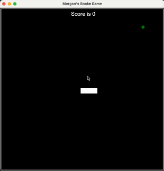
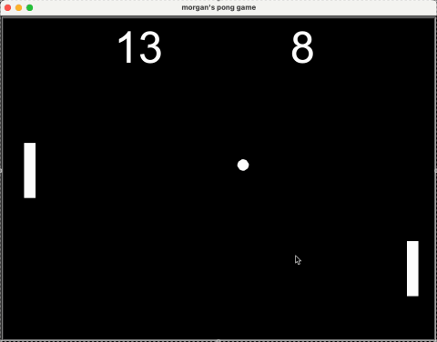
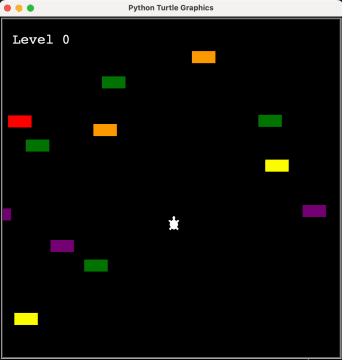

# 100 days of python

The goal is to build 100 small python projects in roughly 100 days. For example:

On Day 21 I built the classic snake game:

On Day 22 I built the pong:

On Day 23 was an emulation of chicken crossing but with a turtle:

<!-- 

  
  

 -->